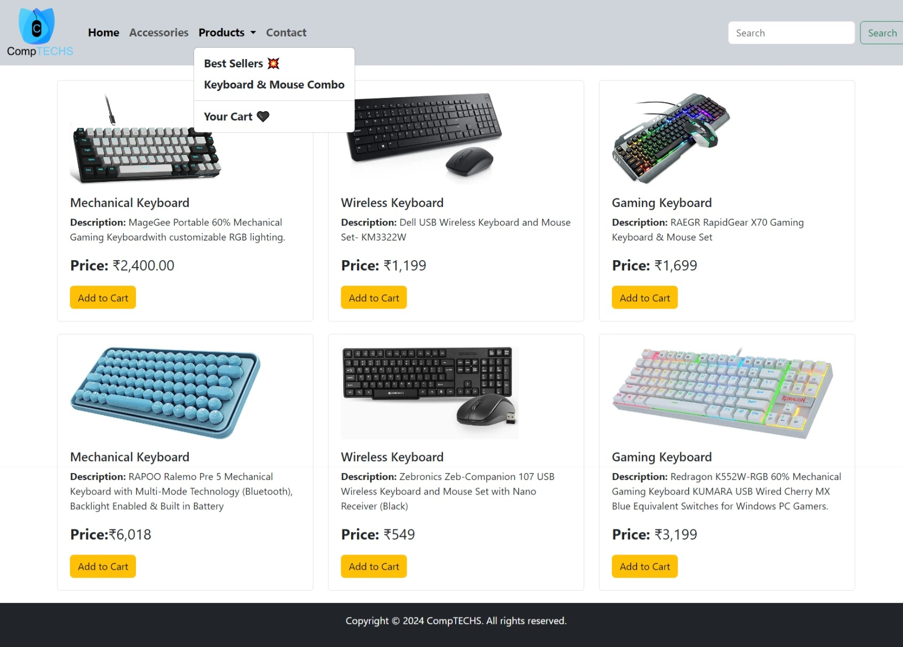

# Product Catalog Webpage

This is a simple webpage demonstrating a product catalog using HTML and Bootstrap. It includes a navigation bar, product cards, and basic styling.

## Features

- Responsive layout using Bootstrap's grid system.
- Navbar for easy navigation.
- Product cards with images, descriptions, prices, and add to cart buttons.

## Preview

## Usage

Simply open the `index.html` file in your web browser to view the product catalog.

## Contributing

Pull requests are welcome. For major changes, please open an issue first to discuss what you would like to change.
